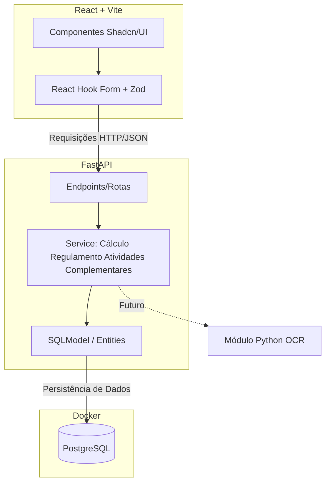

## PARA VISUALIZAR O DIAGRAMA:
CTRL + SHIFT + V

```mermaid
graph TD
    subgraph Frontend [React + Vite]
        UI[Componentes Shadcn/UI] --> Forms[React Hook Form + Zod]
    end

    subgraph Backend [FastAPI]
        API[Endpoints/Rotas] --> Logic[Service: Cálculo Regulamento Atividades Complementares]
        Logic --> Models[SQLModel / Entities]
    end

    subgraph Infra [Docker]
        DB[(PostgreSQL)]
    end

    Forms -->|Requisições HTTP/JSON| API
    Models -->|Persistência de Dados| DB
    Logic -.->|Futuro| OCR[Módulo Python OCR]

```
