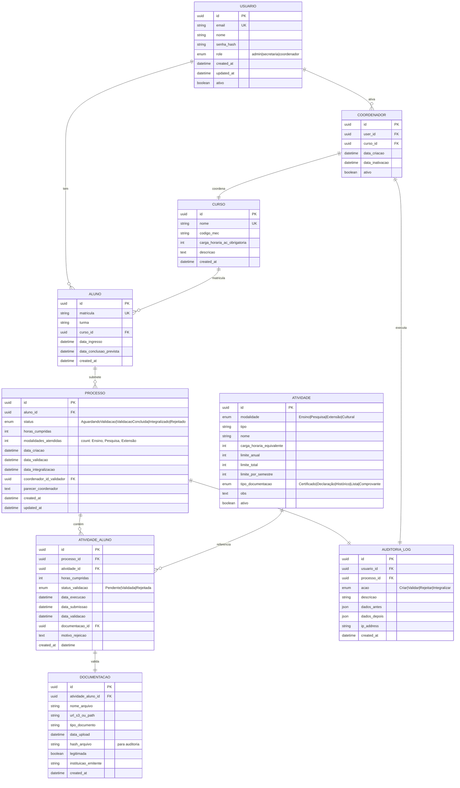

# Diagrama de Entidades do Banco de Dados

Mapeamento das entidades do regulamento para tabelas PostgreSQL.

## Padrões

- snake_case para nomes de tabelas
- nomes de tabelas sempre no plural
- nomes de tabelas sempre em minúsculo

## Alembic

O Alembic serve para atualizar as tabelas no banco de dados.

### Como usar

Após criar uma nova entidade ou fazer alguma alteração em uma já existente, execute no terminal:

**Windows:**
```bash
.\backend\scripts\alembic_migrate.bat "mensagem sobre a alteração"
```

**Linux**
```bash
.\backend\scripts\alembic_migrate.sh "mensagem sobre alteração"
```

Isso deve ser feito **sempre** que uma entidade for criada ou alterada.

Não esquecer de adicionar a versão do banco criada pelo Alembic (dentro de `/migrations/versions/`) no repositório.

## Visualização (Mermaid)


---

## Descrição das Entidades

### **USUARIO** (Identity/Auth)
- Tabela central de autenticação
- Roles: **admin**, **secretaria**, **coordenador** (3 apenas)
- ⚠️ **Aluno NÃO tem login** - tabela ALUNO é separada (dados cadastrais apenas)
- **Campos críticos:**
  - `role`: Determina acesso (ver [DIAGRAMA_AUTENTICACAO.md](../fluxos/DIAGRAMA_AUTENTICACAO.md))
  - `ativo`: Soft delete

### **ALUNO** 
- Dados cadastrais (NÃO tem user_id automaticamente)
- Criado por: `admin` ou `secretaria` via API (`POST /alunos`)
- **Campos críticos:**
  - `matricula`: Identificador acadêmico único
  - `turma`: Necessário para validações administrativas
  - `data_conclusao_prevista`: Prazo para integralizar AC

### **COORDENADOR**
- Estende USUARIO (user_id obrigatório)
- Vinculado a um CURSO
- **Responsabilidades:** Validar atividades, emitir parecer

### **CURSO**
- Catálogo de cursos
- **Campo crítico:** `carga_horaria_ac_obrigatoria` (varia por curso)

### **ATIVIDADE** (Catálogo do ANEXO A)
- **37 registros** = 37 atividades do REGULAMENTO_RESUMO.md
- **Campos críticos:**
  - `limite_anual`: Para palestras 60h/ano, cursos 40h/ano
  - `limite_total`: Para intercâmbio máx 2
  - `limite_por_semestre`: Para doação sangue 10h/sem
  - **Lógica**: Se `limite_anual` ≠ NULL → validar por data

### **PROCESSO** (Requerimento de Validação)
- Ciclo de vida do "protocolo" de AC
- **Estados (enum status):**
  1. **AguardandoValidacao**: Secretaria criou, aguardando coordenador
  2. **ValidacaoConcluida**: Coordenador terminou validação
  3. **Integralizado**: Registrado no histórico escolar
  4. **Rejeitado**: Falhou validação
- **Campo crítico:** `status` (enum) → Máquina de estados

### **ATIVIDADE_ALUNO** (Registro de Execução)
- Associação M:N entre PROCESSO e ATIVIDADE
- **Estados de validação (enum status_validacao):**
  - `Pendente`: Aguardando coordenador
  - `Validada`: Contabilizada (horas/modalidade)
  - `Rejeitada`: Motivo em `motivo_rejeicao`

### **DOCUMENTACAO** (Comprovante)
- Armazena upload de certificados, declarações, históricos
- **Campos críticos:**
  - `url_s3_ou_path`: Path S3 ou local filesystem
  - `hash_arquivo`: Auditoria (detecta alterações)
  - `legitimada`: Sim/Não (instituição validou?)

### **AUDITORIA_LOG** (Rastreabilidade)
- Rastreamento de todas mudanças de estado
- **Campos:** `dados_antes` e `dados_depois` em JSON para compliance/auditoria

---

## Índices Recomendados

```sql
-- Queries frequentes
CREATE INDEX idx_aluno_matricula ON aluno(matricula);
CREATE INDEX idx_aluno_curso_id ON aluno(curso_id);
CREATE INDEX idx_processo_aluno_id ON processo(aluno_id);
CREATE INDEX idx_processo_status ON processo(status);
CREATE INDEX idx_atividade_aluno_processo_id ON atividade_aluno(processo_id);
CREATE INDEX idx_atividade_aluno_status_validacao ON atividade_aluno(status_validacao);
CREATE INDEX idx_documentacao_atividade_aluno_id ON documentacao(atividade_aluno_id);
CREATE INDEX idx_auditoria_log_proceso_id ON auditoria_log(processo_id);
CREATE INDEX idx_auditoria_log_created_at ON auditoria_log(created_at);
```

---

## Fluxo de Ciclo de Vida (PROCESSO)

```
┌─ POST /processos (Secretaria cria)
│  └─ PROCESSO.status = "AguardandoValidacao"
│
├─ POST /processos/{id}/atividades (Secretaria adiciona)
│  └─ ATIVIDADE_ALUNO.status_validacao = "Pendente"
│
├─ POST /processos/{id}/atividades/{id}/documentacao (Secretaria upload)
│  └─ DOCUMENTACAO criada
│
├─ PUT /processos/{id}/atividades/{id}/validar (Coordenador valida)
│  └─ ATIVIDADE_ALUNO.status_validacao = "Validada" OU "Rejeitada"
│
├─ PUT /processos/{id}/validacao-completa (Coordenador finaliza)
│  └─ Backend valida: 2 modalidades? Horas ok? Limites respeitados?
│     ├─ ✅ SIM  → PROCESSO.status = "ValidacaoConcluida"
│     └─ ❌ NÃO  → PROCESSO.status = "Rejeitado" + motivo
│
└─ PUT /processos/{id}/registrar-historico (Secretaria finaliza)
   └─ PROCESSO.status = "Integralizado"
      ALUNO.carga_horaria_ac_cumprida += horas
```

---

## Referências Cruzadas

- [REGULAMENTO_RESUMO.md](../regulamento/REGULAMENTO_RESUMO.md) - 37 atividades com limites
- [DIAGRAMA_AUTENTICACAO.md](../fluxos/DIAGRAMA_AUTENTICACAO.md) - Roles e permissões (3 atores)
- [DIAGRAMA_FLUXO_PROCESSOS.md](../fluxos/DIAGRAMA_FLUXO_PROCESSOS.md) - Máquina de estados visual
- [API_SPEC.md](../api/API_SPEC.md) - Endpoints de CRUD
