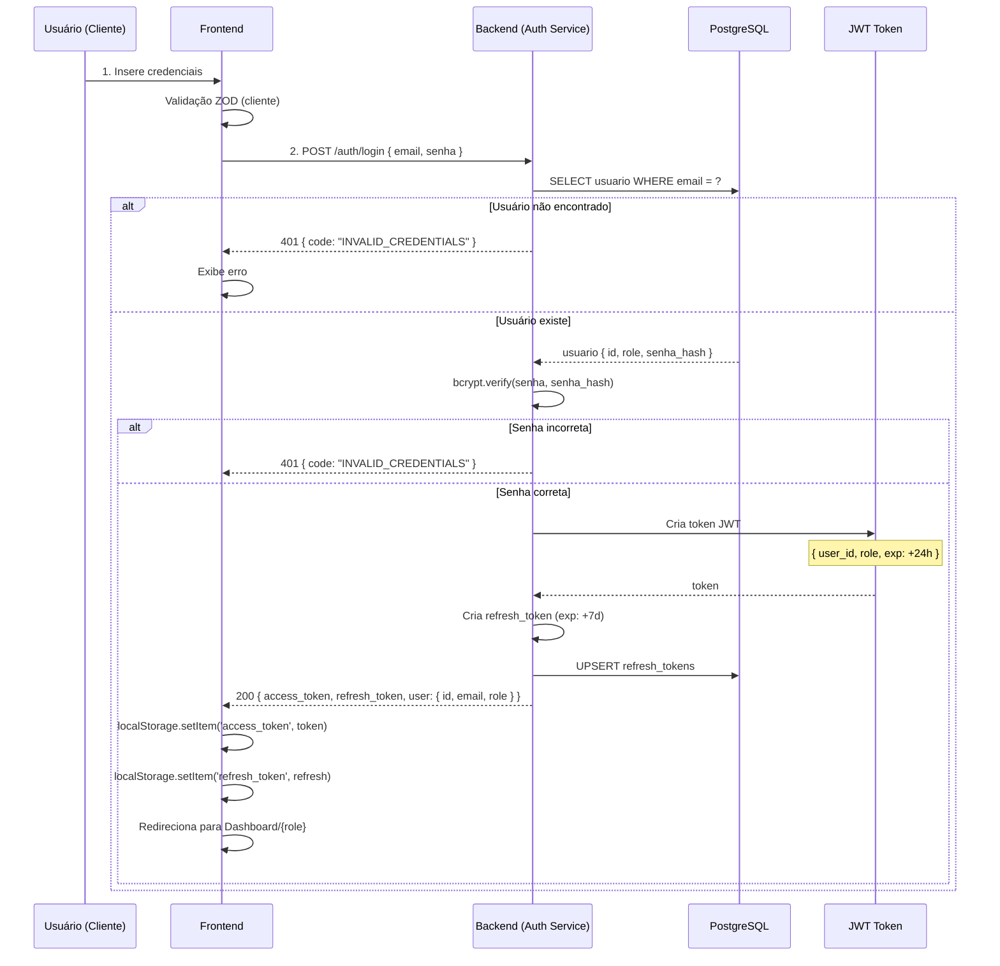

# Diagrama de Autenticação e Autorização (JWT + RBAC)

Sistema de autenticação com JWT e controle de acesso baseado em 3 roles (RBAC).

**Arquitetura:** Apenas 3 atores têm login no sistema. Aluno é externo (envia email, não tem conta).

## Visualização: Fluxo de Login



---

## Modelo de Roles e Permissões (3 Atores Internos)

```mermaid
graph TD
    Admin["ADMIN - Faculdade"]
    Secretaria["SECRETARIA - Operacional"]
    Coordenador["COORDENADOR - Validação"]
    
    Admin -->|Pode| A1["CRUD Usuários (Secretaria + Coordenador)"]
    Admin -->|Pode| A2["CRUD Cursos e Estrutura"]
    Admin -->|Pode| A3["Atualizar Regulamento (ANEXO A)"]
    Admin -->|Pode| A4["Ver Auditoria Completa"]
    Admin -->|Pode| A5["Configurar Calendário Acadêmico"]
    
    Secretaria -->|Pode| S1["Cadastrar Alunos (manual ou CSV)"]
    Secretaria -->|Pode| S2["Criar Protocolos AC"]
    Secretaria -->|Pode| S3["Anexar Documentação dos emails"]
    Secretaria -->|Pode| S4["Conferir se docs estão completas"]
    Secretaria -->|Pode| S5["Registrar no Histórico Escolar"]
    Secretaria -->|Pode| S6["Enviar emails aos alunos"]
    Secretaria -->|Pode| S7["Ver Auditoria (filtrado)"]
    
    Coordenador -->|Pode| C1["Ver Processos Pendentes"]
    Coordenador -->|Pode| C2["Validar Atividades"]
    Coordenador -->|Pode| C3["Rejeitar Atividades"]
    Coordenador -->|Pode| C4["Emitir Parecer Final"]
    Coordenador -->|Pode| C5["Ver Auditoria (seu curso)"]
    
    Admin -->|Não Pode| NP1["Usar como Coordenador"]
    Secretaria -->|Não Pode| NP2["Validar Atividades"]
    Coordenador -->|Não Pode| NP3["Registrar no Histórico"]
```



---

## Estrutura do JWT Token

**Payload:**
```json
{
  "user_id": "uuid-123456",
  "email": "coordenador@senai.br",
  "role": "coordenador",
  "nome": "João da Silva",
  "iat": 1712000000,
  "exp": 1712086400
}
```

---

## Permissões por Endpoint (Matriz de Controle)

| Endpoint | GET | POST | PUT | DELETE | Admin | Secretaria | Coordenador | 
|----------|-----|------|-----|--------|-------|-----------|-------------|
| `/usuarios` | Sim | Sim | Sim | Sim | Sim | Não | Não | 
| `/alunos` | Sim | Sim | Sim | Sim | Sim | Sim | Não | 
| `/processos` | Sim | Sim | Sim | Não | Sim | Sim | Sim | 
| `/processos/{id}/validar` | Não | Não | Sim | Não | Sim | Não | Sim | 
| `/processos/{id}/registrar-historico` | Não | Não | Sim | Não | Sim | Sim | Não | 
| `/processos/{id}/documentacao` | Não | Sim | Não | Não | Sim | Sim | Não | 
| `/auditoria` | Sim | Não | Não | Não | Sim | Sim (filtrado) | Sim (filtrado) |

---

## Implementação: Middleware FastAPI

```python
# app/core/security.py
from fastapi import Depends, HTTPException
from fastapi.security import HTTPBearer, HTTPAuthCredentials
import jwt

async def get_current_user(credentials: HTTPAuthCredentials = Depends(HTTPBearer())):
    try:
        token = credentials.credentials
        payload = jwt.decode(token, SECRET_KEY, algorithms=["HS256"])
        user_id = payload.get("sub")
        role = payload.get("role")
        
        if user_id is None:
            raise HTTPException(status_code=401, detail="Invalid token")
            
        return {"user_id": user_id, "role": role}
    except jwt.ExpiredSignatureError:
        raise HTTPException(status_code=401, detail="Token expired")

async def require_role(*allowed_roles: str):
    """Dependency para checar role"""
    async def role_checker(current_user = Depends(get_current_user)):
        if current_user["role"] not in allowed_roles:
            raise HTTPException(status_code=403, detail="Insufficient permissions")
        return current_user
    return role_checker
```

---

## Segurança: Checklist

- ✅ JWT com expiration (24h access, 7d refresh)
- ✅ Refresh tokens armazenados em BD (com rotation)
- ✅ Senhas hasheadas com bcrypt (salt 10)
- ✅ HTTPS obrigatório em produção
- ✅ CORS configurado (origem permitida)
- ✅ Rate limiting no endpoint `/auth/login` (max 5 tentativas/10min)
- ✅ Auditoria de login falho
- ✅ Logout invalida refresh token

**Ver também:** [DIAGRAMA_ENTIDADES_BD.md](DIAGRAMA_ENTIDADES_BD.md) para estrutura de usuários
