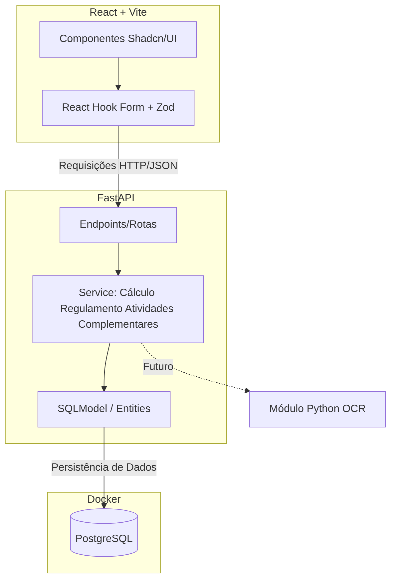

## Diagrama de Arquitetura Técnica

CTRL + SHIFT + V para visualizar

---

## Descrição

- **Frontend**: Interface para Secretaria + Coordenador (Aluno é externo via email)
- **Backend**: API REST com validação de regras (ANEXO A)
- **Banco**: PostgreSQL com 9 tabelas (USUARIO, ALUNO, PROCESSO, ATIVIDADE_ALUNO, DOCUMENTACAO, etc.)
- **OCR**: Futuro - reconhecimento de texto em certificados
