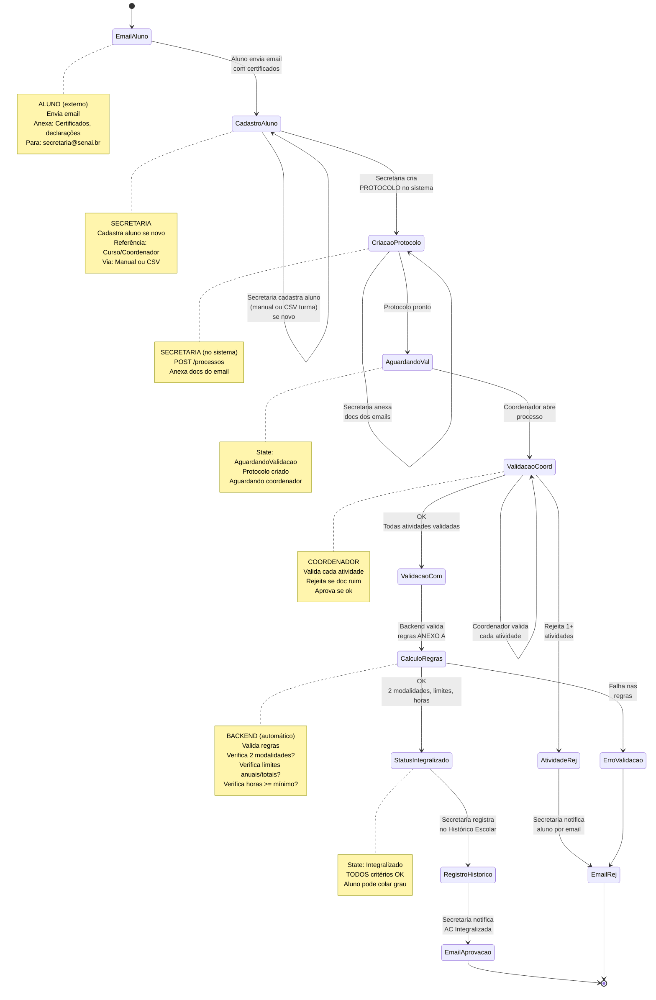

# Diagrama de Fluxo de Processos

Representação visual do ciclo de vida de um Processo (Requerimento de Validação de Atividades Complementares).

**Arquitetura:**

- Aluno é externo (envia email com certificados) - não faz login
- Sistema tem 3 atores com login: Admin, Secretaria, Coordenador
- Secretaria cria protocolos no sistema (não o aluno)

## Visualização: Fluxo Principal

---

## Estados do Processo (State Machine)

| Estado                  | Descrição                           | Ator       | Próximo           | Ações                                          |
| ----------------------- | ----------------------------------- | ---------- | ----------------- | ---------------------------------------------- |
| AguardandoValidacao     | Secretaria criou protocolo com docs | Secretaria | Coordenador       | Secretaria edita atividades/docs se necessário |
| ValidacaoConcluida      | Coordenador finalizou validação     | Backend    | Backend           | Calcula regras automaticamente                 |
| Integralizado           | AC aprovada, horas registradas      | Secretaria | -                 | Registra no histórico escolar depois email     |
| Rejeitado               | Falha em regras ou docs ruins       | Backend    | Aluno (via email) | Aluno reenvia documentos                       |

---

## Responsabilidades por Ator

### Aluno (Externo, sem login)

- Envia email com certificados e documentos para secretaria@senai.br
- Anexos: PDF, JPG de certificados, declarações, comprovantes
- Respeita calendário acadêmico

### Secretaria (Sistema - Operacional)

- Cadastro: INSERT aluno (manual ou CSV da turma) Reference por Curso/Coordenador
- Protocolo: POST /processos {aluno_id}
- Documentação: POST /atividades/{id}/documentacao (anexa links/arquivos dos emails)
- Conferência: Valida se docs estão completas e legíveis
- Notificações: Envia template emails para aluno (rejeição, aprovação)
- Registro Final: PUT /processos/{id}/registrar-historico no Histórico Escolar

### Coordenador (Sistema - Validação)

- Revisão: GET /processos e valida cada atividade conforme ANEXO A
- Aprovação: PUT /atividades/{id}/validar {status: Validada}
- Rejeição: PUT /atividades/{id}/validar {status: Rejeitada, motivo: "..."}
- Parecer: PUT /processos/{id}/validacao-completa (finaliza validação)

### Backend (Automático)

- Cálculo: Valida regras (2 modalidades, limites, horas)
- Status: Auto-atualiza para Integralizado ou Rejeitado
- Events: Publica eventos para listeners (email, auditoria)

**Fluxo:** Email input > Secretaria operador > Coordenador validador > Backend automático > Secretaria registrador > Email output
